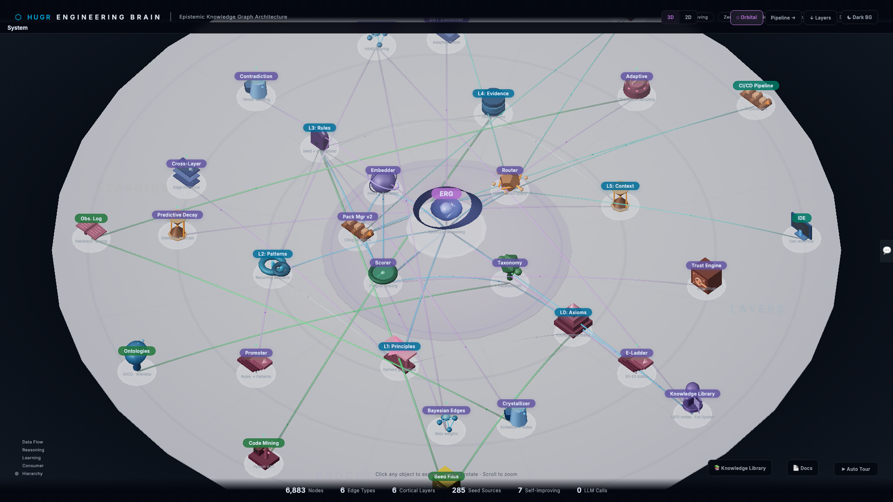

<div align="center">

<picture>
  <source media="(prefers-color-scheme: dark)" srcset="docs/assets/hugr-logo-dark.svg">
  <source media="(prefers-color-scheme: light)" srcset="docs/assets/hugr-logo-light.svg">
  
</picture>

<br><br>

# Engineering Brain

**The knowledge graph that makes AI coding agents actually good.**

<br>

<picture>
  <source media="(prefers-color-scheme: dark)" srcset="docs/assets/hero-dark.png">
  <source media="(prefers-color-scheme: light)" srcset="docs/assets/hero-light.png">
  
</picture>

<br><br>

[](LICENSE)
[](https://python.org)
[](#mcp-tools)
[](#)
[](cockpit/)

**3,700+ nodes** · **285 seeds** · **32 edge types** · **6 cortical layers** · **Zero LLM calls**

</div>

<br>

## The idea is simple

AI coding agents are smart, but they have no memory. Every time they start a task, they reason from scratch — rediscovering the same pitfalls, re-learning the same patterns, burning tokens on knowledge that already exists.

Engineering Brain fixes this. It's a **curated knowledge graph** — 3,700+ rules, patterns, and principles organized in 6 layers from universal truths down to code-level evidence. Your agent queries the brain and gets deterministic, source-backed answers in milliseconds. No LLM calls. No hallucination. No guessing.

The **3D Cockpit** lets you see the whole thing — explore nodes, drill into submaps, watch the epistemic engine track confidence, decay, and contradictions in real time.

## Quick start

### MCP Server (plug into any agent)

```json
{
  "mcpServers": {
    "engineering-brain": {
      "command": "python",
      "args": ["-m", "engineering_brain.mcp_server"]
    }
  }
}
```

Then just ask: *"Query the brain about Flask CORS security"*

### Python library

```python
from engineering_brain import Brain

brain = Brain()
brain.seed()  # 285 curated seed files

result = brain.query("async error handling in Python")
pack = brain.create_pack("security review", technologies=["flask"])
contradictions = brain.detect_contradictions()
```

### 3D Cockpit

```bash
pip install -e brain/ -e cockpit/
cd cockpit && python -m server.main
# → http://localhost:8420
```

## What's under the hood

<table>
<tr>
<td width="50%">

### Brain (Knowledge Graph)

- **6 cortical layers** — Axioms → Principles → Patterns → Rules → Evidence → Context
- **285 YAML seeds** across 66 technologies and 69 domains
- **Epistemic reasoning** — Subjective Logic, Dempster-Shafer fusion, contradiction detection, trust propagation
- **Predictive decay** — freshness tracking with per-domain half-life models
- **Self-improving** — Thompson Sampling optimizes retrieval from feedback
- **5 backends** — Memory, FalkorDB, Qdrant, Redis, Neo4j

</td>
<td width="50%">

### Cockpit (3D Visualization)

- **Three.js orbital graph** with bloom, instanced rendering
- **5-level fractal drill-down** — system → module → file → function → code
- **Knowledge Library** — filter, group, search across all nodes
- **Epistemic dashboard** — E0-E5 ladder, freshness, contradictions
- **Auto-tour** — guided architecture walkthrough
- **Desktop** (Tauri) · **Terminal** (Rust TUI) · **VS Code** extension

</td>
</tr>
</table>

## How the brain thinks (without an LLM)

Most knowledge systems throw everything into a vector database and hope for the best. Engineering Brain takes a different path:

1. **Layered structure** — Knowledge lives at the right level of abstraction. "All input must be validated" (Axiom, L0) grounds "Defense in depth" (Principle, L1) which informs "Circuit breaker pattern" (Pattern, L2) which generates "Flask CORS: never use `origins='*'` in production" (Rule, L3).

2. **Epistemic engine** — Every node has a belief score (Subjective Logic), evidence support (Dempster-Shafer), and a decay curve. When two rules contradict, the brain detects it, quantifies the conflict, and surfaces both sides with confidence scores.

3. **7-signal scoring** — Retrieval ranks nodes by technology match, domain match, severity, reinforcement count, recency, confidence, and vector similarity. Weights are optimized via Thompson Sampling from real feedback.

4. **Knowledge promotion** — When a finding at L4 gets reinforced 5+ times, it promotes to a Rule at L3. Bayesian Beta priors per domain prevent premature promotion. Knowledge that decays gets demoted.

## MCP tools

20 tools available via [Model Context Protocol](https://modelcontextprotocol.io):

| | Tool | What it does |
|---|------|-------------|
| **Query** | `brain_query` | Knowledge retrieval with epistemic confidence |
| | `brain_think` | Deep query — confidence tiers + gap analysis |
| | `brain_reason` | Multi-chain reasoning with alternatives |
| | `brain_search` | Filter by technology, domain, or text |
| **Learn** | `brain_learn` | Report findings for the brain to absorb |
| | `brain_reinforce` | Strengthen or weaken rules with evidence |
| | `brain_mine_code` | AST pattern mining from Python source |
| **Validate** | `brain_validate` | Check rules against external sources |
| | `brain_contradictions` | Surface conflicting knowledge |
| | `brain_provenance` | Trace a rule's full origin chain |
| **Packs** | `brain_pack` | Curated knowledge bundle for a task |
| | `brain_pack_templates` | Architecture tradeoff, security review, etc. |
| | `brain_pack_compose` | Merge multiple packs |
| | `brain_pack_export` | Export as standalone MCP server |
| **Feedback** | `brain_feedback` | Flag unhelpful results |
| | `brain_observe_outcome` | Record if a result was useful |
| | `brain_prediction_outcome` | Track prediction accuracy |
| | `brain_promotion_outcome` | Monitor promoted knowledge survival |
| **Meta** | `brain_stats` | Graph health and metrics |
| | `brain_communities` | Knowledge clusters |

Full reference: [docs/mcp-tools.md](docs/mcp-tools.md)

## How it compares

| | Engineering Brain | GraphRAG | LightRAG | Mem0 |
|---|:-:|:-:|:-:|:-:|
| Human-curated knowledge | **Yes** | No | No | No |
| Zero LLM reasoning | **Yes** | No | No | No |
| Epistemic tracking (E0-E5) | **Yes** | No | No | No |
| Contradiction detection | **Yes** | No | No | No |
| Self-improving from feedback | **Yes** | No | No | No |
| 3D visualization | **Yes** | No | No | No |
| MCP server | **Yes** | No | No | No |
| Predictive decay | **Yes** | No | No | No |
| Multiple backends | **Yes** | Yes | Yes | Yes |

## Install

```bash
git clone https://github.com/humangr-lab/engineering-brain.git
cd engineering-brain
make install  # brain + cockpit + deps
make test     # 745 tests
```

Or just the brain:

```bash
pip install -e brain/          # core
pip install -e brain/[backends] # + vector search
pip install -e brain/[all]     # everything
```

## Project layout

```
brain/                  Knowledge graph engine (Python)
├── engineering_brain/  3,700+ nodes, 20 MCP tools, epistemic reasoning
├── tests/              669 tests
└── pyproject.toml

cockpit/                3D visualization suite
├── server/             FastAPI backend
├── client/             Three.js frontend
├── tui/                Rust terminal UI
├── app/                Tauri desktop app
├── vscode/             VS Code extension
└── tests/              76 tests

docs/                   Architecture, MCP reference, extending guide
```

## Extending

Add your own knowledge as YAML seeds:

```yaml
# brain/engineering_brain/seeds/my_domain.yaml
layer: rules
domain: security
knowledge:
  - id: CR-MY-001
    statement: "Never store API keys in source code"
    severity: critical
    technologies: { lang: [python, javascript] }
    domains: { domain: [security], concern: [secrets] }
```

Full guide: [docs/extending.md](docs/extending.md)

## Contributing

```bash
make install && make test && make lint
```

See [CONTRIBUTING.md](CONTRIBUTING.md) for the full workflow.

## License

[Apache License 2.0](LICENSE) — use it, build on it, make it yours.

---

<div align="center">

<picture>
  <source media="(prefers-color-scheme: dark)" srcset="docs/assets/hugr-logo-dark.svg">
  <source media="(prefers-color-scheme: light)" srcset="docs/assets/hugr-logo-light.svg">
  
</picture>

<br>

<sub>Built by <a href="https://github.com/gustavoschneiter">Gustavo Schneiter</a> · <a href="https://github.com/humangr-lab">Human Guardrail</a></sub>

</div>
