<div align="center">

# Engineering Brain

**Curated knowledge graph + 3D visualization for LLM coding agents**

[](#)
[](#)
[](LICENSE)
[](https://python.org)
[](#mcp-integration)

**3,700+ curated nodes** · **285 seed files** · **66 technologies** · **20 MCP tools** · **6 cortical layers** · **Zero LLM calls for reasoning**

</div>

---

## What Is This?

A **knowledge graph** purpose-built for AI coding agents. Instead of sending every question to an LLM, agents query the brain for curated engineering rules, patterns, and principles — getting deterministic, source-backed answers in milliseconds.

The **3D Cockpit** lets you explore, navigate, and understand the entire knowledge graph through an interactive Three.js visualization with drill-down submaps, epistemic status tracking, and real-time updates.

## Quick Start

### As MCP Server (recommended)

Add to your Claude Desktop or Claude Code config:

```json
{
  "mcpServers": {
    "engineering-brain": {
      "command": "python",
      "args": ["-m", "engineering_brain.mcp_server"]
    }
  }
}
```

Then ask your agent: *"Query the engineering brain about Flask CORS security best practices"*

### As Python Library

```bash
pip install -e brain/
```

```python
from engineering_brain import Brain

brain = Brain()
brain.seed()  # Load 285 curated seed files

# Query with epistemic reasoning
result = brain.query("Python async error handling patterns")
print(result.nodes)       # Relevant rules and patterns
print(result.confidence)  # Confidence with reasoning chain

# Detect contradictions in knowledge
contradictions = brain.detect_contradictions()

# Create a knowledge pack for a specific task
pack = brain.create_pack("security review", technologies=["flask", "cors"])
```

### 3D Cockpit

```bash
pip install -e brain/ -e cockpit/
cd cockpit && python -m server.main
# Open http://localhost:8420
```

## Features

### Brain (Knowledge Graph)

- **3,700+ curated nodes** across 6 cortical layers (Axioms → Principles → Patterns → Rules → Evidence → Context)
- **285 YAML seed files** covering 66 technologies and 69 domains
- **20 MCP tools** — query, think, reason, search, learn, validate, packs, communities, and more
- **Epistemic reasoning** — Subjective Logic, Dempster-Shafer evidence fusion, contradiction detection, trust propagation (zero LLM calls)
- **Predictive decay** — freshness tracking with per-domain half-life models
- **Self-improving** — Thompson Sampling optimizes retrieval weights from feedback
- **Pluggable backends** — Memory (default), FalkorDB, Qdrant, Redis, Neo4j

### Cockpit (Visualization)

- **3D interactive graph** — Three.js orbital layout with bloom effects and instanced rendering
- **Knowledge Library** — paginated, filterable, 5 grouping modes (layer, severity, tag, taxonomy, edges)
- **Epistemic dashboard** — E0-E5 ladder distribution, freshness decay, contradiction tracking
- **Drill-down submaps** — 5 levels of detail for each system module
- **Auto-tour** — guided walkthrough of the architecture
- **Desktop app** — Tauri (experimental)
- **Terminal UI** — Rust TUI with force-directed Braille rendering ([crates.io](https://crates.io/crates/ontology-map-tui))
- **VS Code extension** — architecture view inside the editor

## Architecture

```mermaid
graph TB
    subgraph Seeds["285 YAML Seed Files"]
        S1[Security] --> I
        S2[API Design] --> I
        S3[Testing] --> I
        S4[Performance] --> I
    end

    I[Ingestion Engine] --> G

    subgraph G["Knowledge Graph (6 Layers)"]
        L0[L0: Axioms] --> L1[L1: Principles]
        L1 --> L2[L2: Patterns]
        L2 --> L3[L3: Rules]
        L3 --> L4[L4: Evidence]
        L4 --> L5[L5: Context]
    end

    G --> R[Retrieval Engine]
    G --> E[Epistemic Engine]

    R --> MCP[MCP Server<br/>20 Tools]
    E --> MCP

    MCP --> A1[Claude Code]
    MCP --> A2[Other AI Agents]

    G --> API[REST API]
    API --> C[3D Cockpit]

    style G fill:#1a1a2e,stroke:#6b8fff
    style MCP fill:#2d1b69,stroke:#9b7cff
    style C fill:#1b3a2d,stroke:#34d399
```



## Comparison

| Feature | Engineering Brain | GraphRAG | LightRAG | Mem0 |
|---------|:-:|:-:|:-:|:-:|
| Curated knowledge (not auto-generated) | **Yes** | No | No | No |
| Zero LLM calls for reasoning | **Yes** | No | No | No |
| Epistemic status tracking (E0-E5) | **Yes** | No | No | No |
| Contradiction detection | **Yes** | No | No | No |
| Self-improving (Thompson Sampling) | **Yes** | No | No | No |
| 3D visualization | **Yes** | No | No | No |
| MCP server | **Yes** | No | No | No |
| Knowledge decay prediction | **Yes** | No | No | No |
| Multiple backends | **Yes** | Yes | Yes | Yes |
| Production node count | 3,700+ | Varies | Varies | Varies |

## MCP Integration

20 tools available via Model Context Protocol:

| Tool | Description |
|------|-------------|
| `brain_query` | Query knowledge with epistemic confidence |
| `brain_think` | Enhanced query with confidence tiers and gap analysis |
| `brain_reason` | Multi-chain structured reasoning |
| `brain_search` | Search by technology or domain |
| `brain_learn` | Report findings for the brain to learn from |
| `brain_validate` | Validate knowledge against external sources |
| `brain_stats` | Graph statistics and health |
| `brain_contradictions` | List detected contradictions |
| `brain_provenance` | Trace the origin of a rule |
| `brain_communities` | List knowledge communities |
| `brain_feedback` | Report unhelpful rules |
| `brain_pack` | Create curated knowledge packs |
| `brain_pack_templates` | List available pack templates |
| `brain_pack_compose` | Compose multiple packs |
| `brain_pack_export` | Export pack as standalone MCP server |
| `brain_reinforce` | Strengthen or weaken rules with evidence |
| `brain_observe_outcome` | Record query helpfulness |
| `brain_prediction_outcome` | Record rule prediction accuracy |
| `brain_promotion_outcome` | Track promoted knowledge survival |
| `brain_mine_code` | Mine patterns from Python source via AST |

## Knowledge Coverage

| Domain | Nodes | Example Technologies |
|--------|------:|---------------------|
| Security | 500+ | CORS, auth, path traversal, injection |
| API Design | 400+ | REST, GraphQL, gRPC, WebSocket |
| Testing | 350+ | pytest, property-based, mutation |
| Performance | 300+ | caching, async, connection pooling |
| Data | 300+ | SQL, Redis, Qdrant, FalkorDB |
| Architecture | 250+ | microservices, event-driven, DDD |
| DevOps | 200+ | Docker, CI/CD, monitoring |
| Frontend | 200+ | React, Three.js, CSS, accessibility |
| AI/ML | 300+ | LLM, RAG, agents, embeddings |
| Reliability | 200+ | SRE, error handling, observability |

## Installation

### Option 1: pip (recommended)

```bash
# Core only
pip install -e brain/

# With vector search
pip install -e brain/[backends]

# Everything
pip install -e brain/[all]

# Cockpit
pip install -e cockpit/
```

### Option 2: From source

```bash
git clone https://github.com/humangr-lab/engineering-brain.git
cd engineering-brain
make install
make test
```

### Option 3: Docker (cockpit only)

```bash
cd cockpit
docker compose up
# Open http://localhost:8420
```

## Project Structure

```
brain/                  Python knowledge graph package
├── engineering_brain/  Core library (3,700+ nodes)
├── pyproject.toml      Package definition
└── tests/              669 tests

cockpit/                Visualization suite
├── server/             FastAPI backend (9 API endpoints)
├── client/             Three.js 3D frontend
├── app/                Tauri desktop app (experimental)
├── tui/                Rust terminal UI
├── vscode/             VS Code extension
└── tests/              76 tests (34 pytest + 42 vitest)

docs/                   Documentation
```

## Contributing

See [CONTRIBUTING.md](CONTRIBUTING.md) for setup instructions and guidelines.

```bash
make install  # Install everything
make test     # Run all tests
make lint     # Check code quality
```

## License

[Apache License 2.0](LICENSE)

---

<div align="center">
  <sub>Built with care by <a href="https://github.com/humangr-lab">Human Guardrail</a></sub>
</div>
